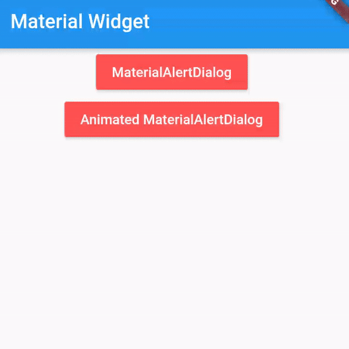

# Material Alert Dialogs for Flutter 📱

A new Flutter package project.

## Getting Started

This project is a starting point for a Dart
[package](https://flutter.dev/developing-packages/),
a library module containing code that can be shared easily across
multiple Flutter or Dart projects.

For help getting started with Flutter, view our 
[online documentation](https://flutter.dev/docs), which offers tutorials, 
samples, guidance on mobile development, and a full API reference.

Android Library to implement *animated*, 🥰 *Attractive*, 🎨*stylish* Material Dialog in android apps easily.

<table style="width:100%">
  <tr>
    <th><b>1. Material Dialog<b></b></th>
    <th>2. Animated Material Dialog</th> 
  </tr>
  <tr>
    <td></td>
    <td></td>
  </tr>
</table>
