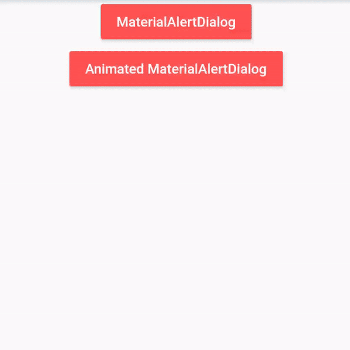
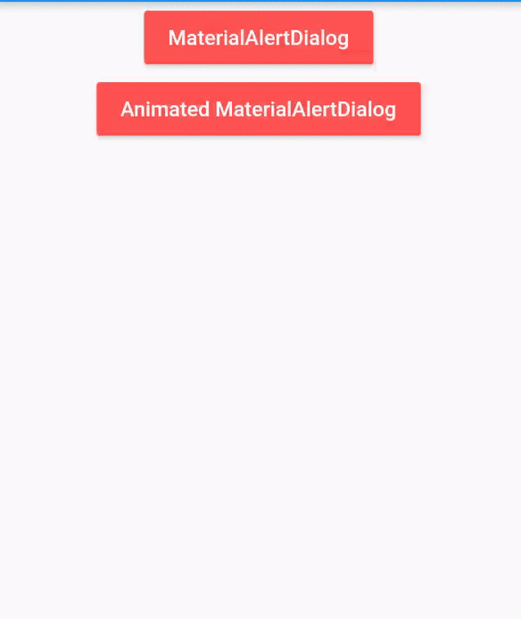
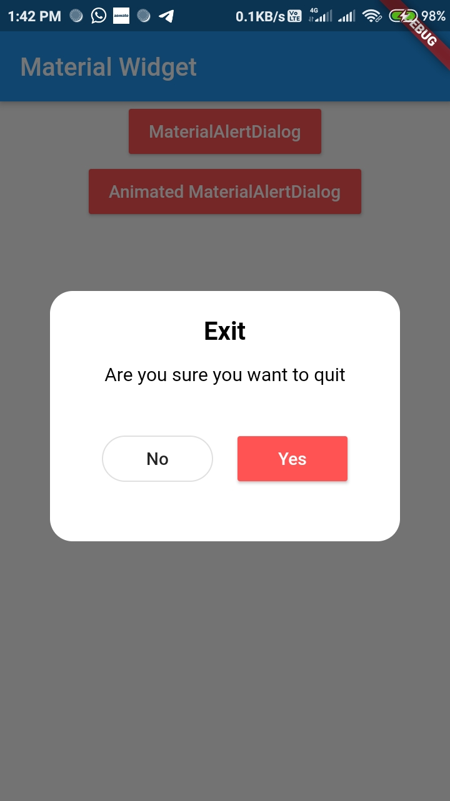
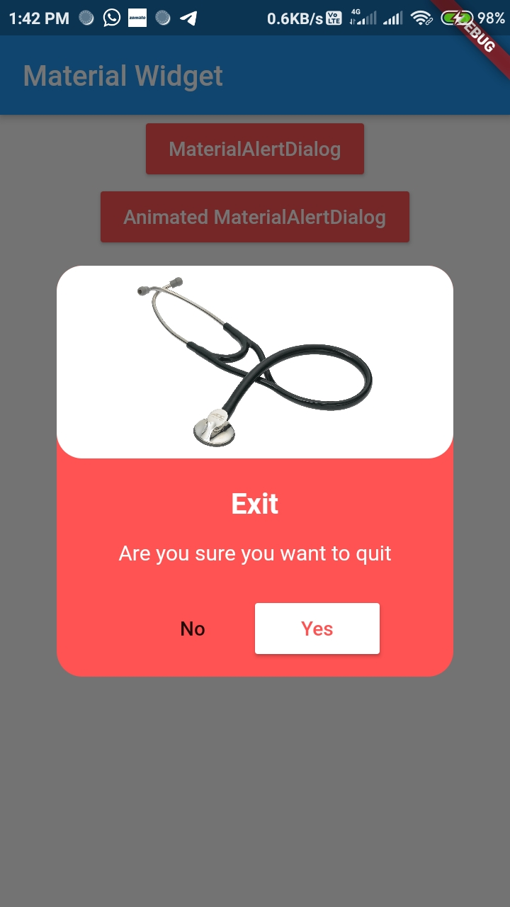

# Material Alert Dialogs for Flutter 📱

A new Flutter package project.

## Getting Started

This project is a starting point for a Dart
[package](https://flutter.dev/developing-packages/),
a library module containing code that can be shared easily across
multiple Flutter or Dart projects.

For help getting started with Flutter, view our 
[online documentation](https://flutter.dev/docs), which offers tutorials, 
samples, guidance on mobile development, and a full API reference.

## Android Library to implement *animated*, 🥰 *Attractive*, 🎨*stylish* Material Dialog in Flutter easily.

<table style="width:100%">
  <tr>
    <th><b>1. Material Dialog<b></b></th>
    <th>2. Animated Material Dialog</th> 
  </tr>
  <tr>
    <td></td>
    <td></td>
  </tr>
</table>

# Introduction

**MaterialAlerDialog** library is built upon Flutter Material Design library. This API will be useful to create rich, animated, beautiful dialogs in Flutter  easily. 

<table style="width:100%">
  <tr>
    <th><b>1. Material Alert Dialog<b></b></th>
    <th>2. Animated Material Alert Dialog</th>
  </tr>
  <tr>
    <td>This is basic material dialog which has two material buttons (Same as Fluter's AlertDialog) as you can see below.</td>
    <td>This is Animated material alert  dialog which has two material buttons which is showed from bottom of device as you can see below.</td> 
  </tr>
  <tr>
    <td align="center"></td>
    <td align="center"></td> 
  </tr>
</table>

## Implementation
Implementation of Material Alert Dialog library is so easy. You can check [/app](/app) directory for demo. Let's have look on basic steps of implementation.

### Create AlertDialog Instance
As there are two types of dialogs in library. Material Dialogs are instantiated as follows.
#### i. MaterialAlertDialog
`MaterialDialog` class is used to create MaterialAlertDialog. Its static `Builder` class is used to instantiate it. 
```java
       showDialog(context: context, builder:(context)=>
       MaterialAlertDialog(

                      height: 250,

                      title: "Exit",

                      message: "Are you sure you want to quit",

                     onPresedPositiveButton: (){
                       //add what you want for navigate
                     },

                      onPresedNegativeButton: (){
                        Navigator.pop(context);
                      },

                   ),
               );
```


#### ii. MaterialAlertDialog
`AnimatedMaterialAlertDialog` class is used to create MaterialAlertDialog. Its static `Builder` class is used to instantiate it. 
```java
       showDialog(context: context, builder:(context)=>
       AnimatedMaterialAlertDialog(
                      
                      imagePath: "assets/steth.jpg"
                      
                      height: 250,

                      title: "Exit",

                      message: "Are you sure you want to quit",

                     onPresedPositiveButton: (){
                     
                       //add what you want for navigate
                       
                     },

                      onPresedNegativeButton: (){
                        Navigator.pop(context);
                      },

                   ),
               );
```


## Credits
This library is built using following open-source libraries.
- [Material Components for Flutter]
- [Material Dialog - Android](https://github.com/PatilShreyas/MaterialDialog-Android/)

